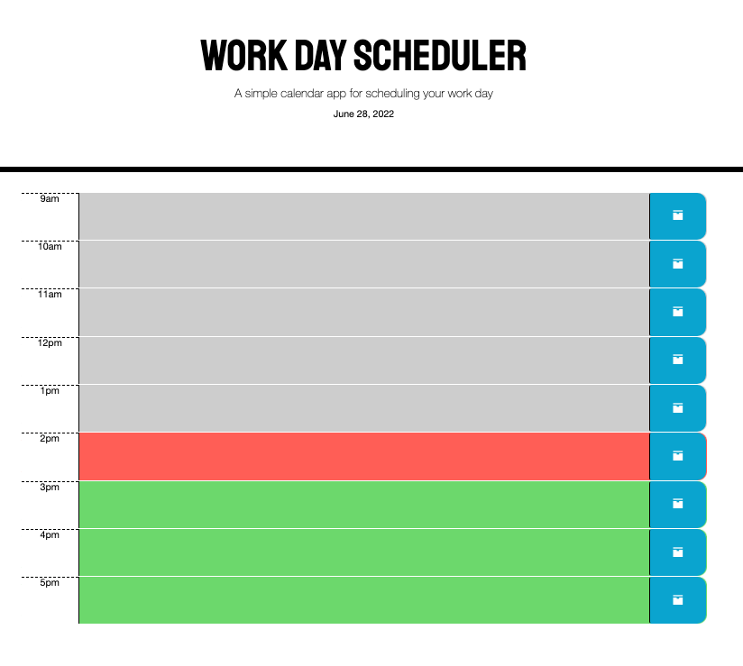

# Work Day Scheduler
## By Christian Rockwood

This application is used to schedule events during standard business hours. The user can click to eneter an event and then save. The application color codes which events are in the past, present, and future. These events will persist even after the page is refreshed.

[Link to deployed application](https://rockwoodc.github.io/work-day-scheduler/)